# Financial Manager

## Name
Financial Manager

## Author
Artemiy Shipovalov. UK MFF, 2024

## Description
This is a simple financial manager. It can help you to manage your money.

## Functionality
- Manage income and expenses
- Use multiple currencies
- Use different cash facilities (cash, bank card, etc.)
- Split transactions into categories
- Analyze income and expenses
- Convert money

## Installation
Install Visual Studio, [.NET 8.0 SDK](https://dotnet.microsoft.com/en-us/download/dotnet/8.0), needed packages (read below) and compile the project.

## Usage
Launch .exe file.

### Setup a DB connection
First you need to open or create a database (further: DB).

**Warning**: You should use **only** DBs created in this app! Otherwise, the correct operation of the application is **not** guaranteed!

#### Create a new DB
If you want to create a new DB, open file menu (in the menu strip), find the button "Create DB" and press on it (or use a shortcut *Ctrl+N*). Then choose a folder where to store your DB, choose a name for it and finally press "Save". If everything is ok, you'll see a successful message. But then you'll immediately see a "Main Currency" error: about it later.
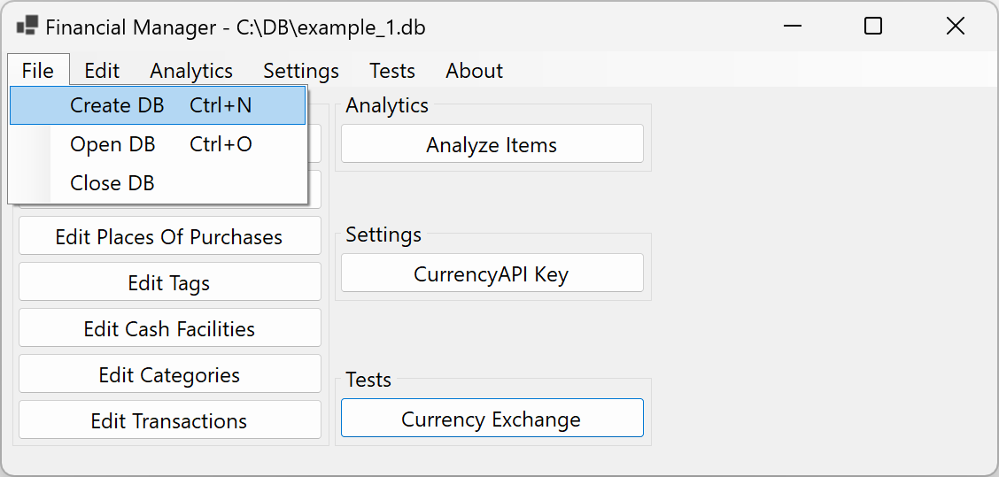

#### Open an existing DB
If you want to open an existing DB, open file menu (in the menu strip), find the button "Open DB" and press on it (or use a shortcut *Ctrl+O*). Then choose a DB file and press "Open". If everything is ok, you'll see a successful message. It's possible, that you'll immediately see a "Main Currency" error: about it later.
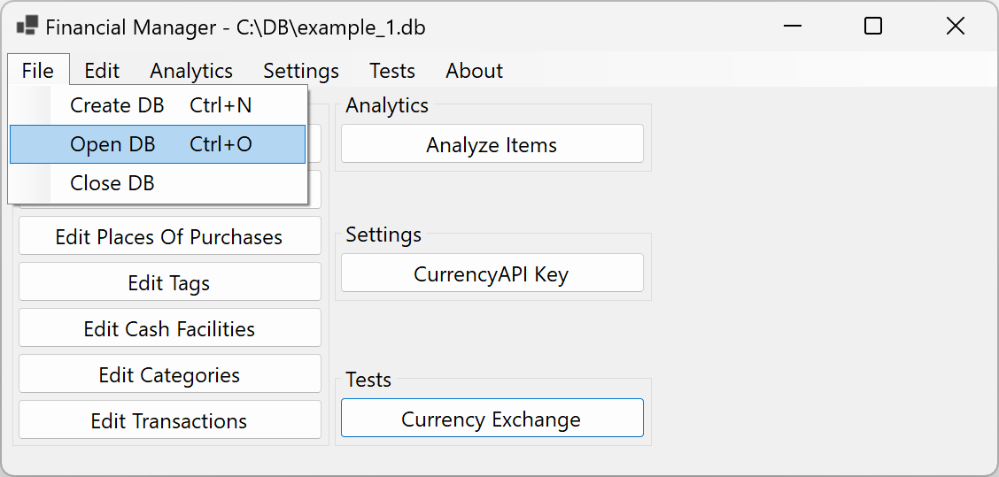

### Setup the Main Currency
When you have a new DB, first you need to do is to setup the Main Currency. Main Currency — currency that is used for storing all money operations. This is necessary, because there is a need of common currency for analytics. All money operations are stored both in currency you've chosen and the Main Currency.

**Warning**: The Main Currency is set for a specific DB **only once**. In future it **can't** be changed!

**Warning**: If the Main Currency is not set, the application **can't** work properly!

To setup it up, press "Edit Currencies" button and the form for editing currencies will be shown. You need to add a new currency and it will be the main one. About editing currencies read further.
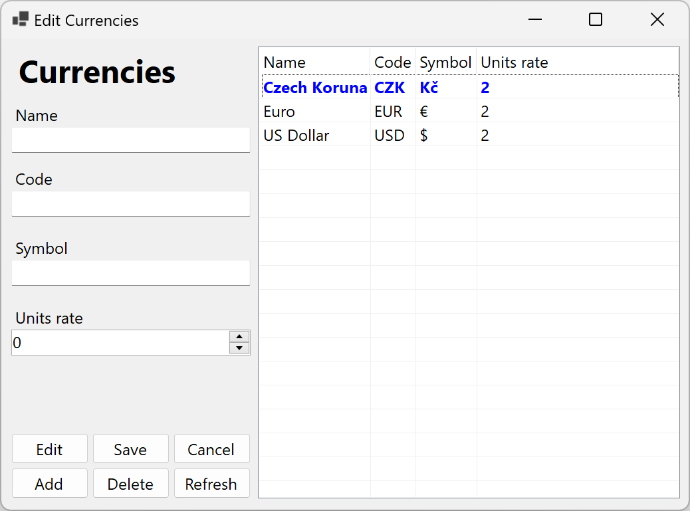

### Setup CurrencyAPI key
Next step is to setup the key for currency exchange service. Here we use [this](https://currencyapi.com) free service. You will need to setup your own API key. Here is an absolutely free variant of account and it's enough for our needs. It provides 300 requests/month and 10 request/minute, a big variety of more than 170 world currencies and ability to get currencies exchange rate not only for today, but also for previous days.

Firstly you need to create an account (choose variant with a free subscription). After completing the registration you'll see the API key in dashboard. Save it, you will need it further.

Now you need to add it to the app settings. Find the button "CurrencyAPI key" in settings section, press it and the form for editing will be shown. Here is the field where you need to enter the key. When you press "Ok", the key will be checked and saved if it's correct.

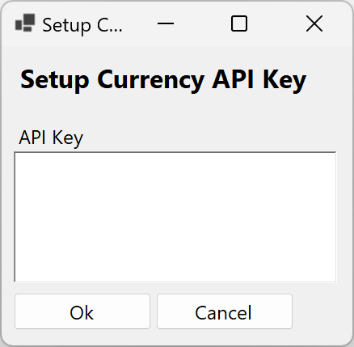

**Notice**: This API key is **common** for all DBs, but **unique** for all users.

**Warning**: Without set up key the application **can't** work properly. You'll be able to do everything **except of** adding/editing Items and exchanging currencies. Also you'll have the same problems if the service is down or you don't have an internet connection.

### Fill other data
This is the last step before you can start using the application fully. You will need to fill other tables. Most of them have a common interface.

#### Edit forms interface
All of the edit forms (forms specified for editing data, in edit section) have a common interface.

##### Add
If you want to add some new item to the table, you need to fill all obligatory field and then press the "Add" button. If fields are filled correctly and in the table there are no similar records, new item will be added.

##### Edit
If you want to edit some item in the table, you need to select an item in the table and then press the "Edit" button. After it the data of this item will be loaded to the form fields. Then you should use either "Save" or "Cancel" button.

##### Save
If you're editing an item, you can change its data in the form fields. If you want to save changes, press the "Save" button. After it data in table will be changed (if the fields were filled correctly).

##### Cancel
If you're editing an item, but you don't want to dave changes, you can press the "Cancel" button and no changes will be applied.

##### Delete
If you want to delete some item in the table, you need to select an item in the table and then press the "Delete" button. After confirming the item will be deleted.

##### Refresh
If you want to refresh all data in the form (including table and other foreign data), press the "Refresh" button.

#### Edit Currencies
Every currency has Name, Code, Symbol and Units rate.
- Name — name of currency (e.g. *US Dollar* or *Czech Republic Koruna*)
- Code — code of currency according to ISO 4217 (and not only), (e.g. *USD* or *CZK*)
- Symbol — currency symbol (e.g. *$* or *Kč*)
- Units rate — by how much order the currency is broken down into. (e.g. *1$ = 100 cents*, so units rate = 2. But *1Ft (Hungarian Forint)* is not divided into subunits, so units rate = 0)

**Warning**: Currency code field is **very important**! If it's incorrect, the application **can't** work properly. Other field are not checked.

**Notice**: [Here](https://currencyapi.com/docs/currency-list) you can find the list of all supported currencies with their codes.

**Notice**: The Main Currency is highlighted in blue color. It **can't** be changed or deleted.

#### Edit Transaction Types
Transaction type can be Income or Expense. It's not possible to add a new or delete an existing transaction type. You have ability only to rename them.
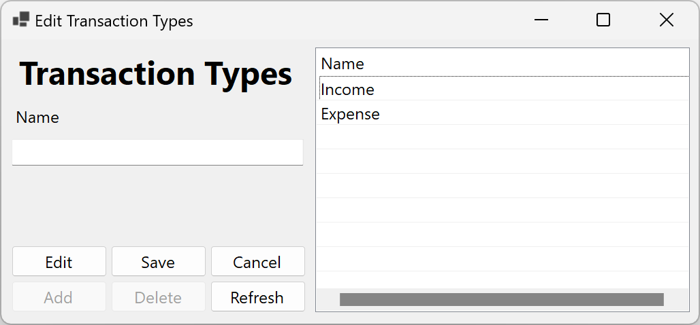

#### Edit Places Of Purchases
This is a list of places where you buy goods (e.g. TESCO, McDonalds, FlixBus and etc.). There is a need for place of purchase mostly for expenses. For income you can choose nothing as place of purchase.
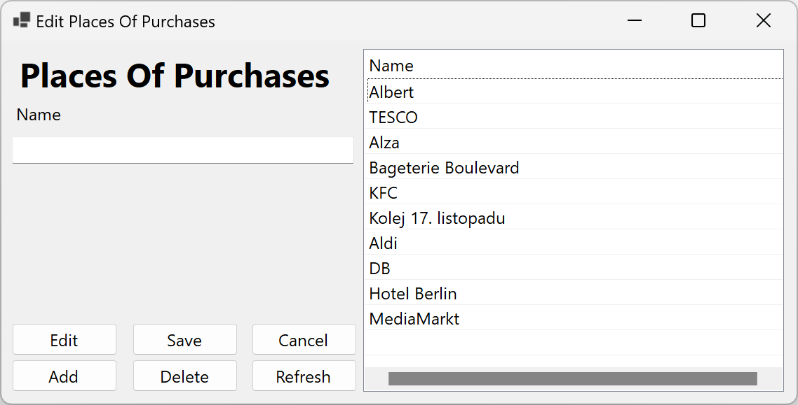

#### Edit Tags
Each tag has Name and Transaction Type. Tags can be used as universal signs for Items. For example, you can mark all spendings while travelling as *#Travelling* and then you'll have ability to easily find them or somehow analyze you spending while travelling. Tags have a limitless scope of use.
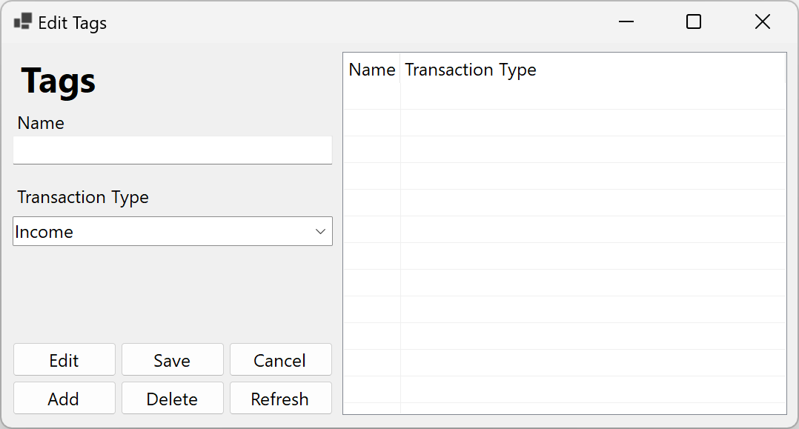

#### Edit Cash Facilities
Each cash facility has Name and Currency. Cash facility can be cash, bank card, bank account or whatever you want.
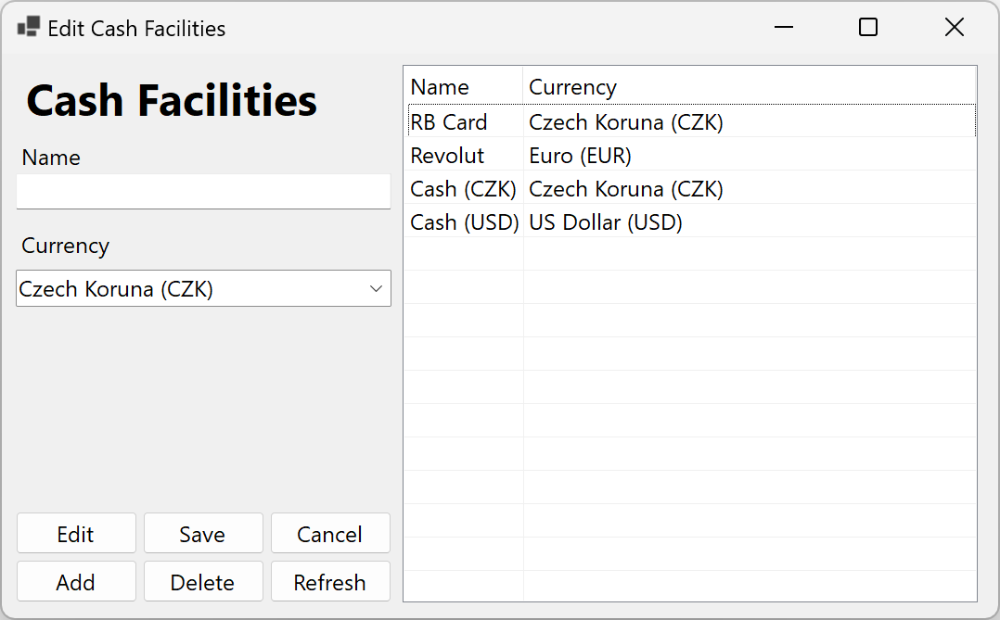

**Notice**: Each cash facility has **exactly** one assigned currency. If you have multi-currency cash facility, you'll need to add for each currency a separate cash facility.

#### Edit Categories
Categories are a hierarchical structure. Each one has Name and at most one parent. Top-level categories don't have parents.

To choose parent category use buttons "Load" and "Clear". First one sets as a parent category chosen one in the table. The second button clears you choice and sets no parent category.

In the table categories with subcategories has a "plus" that loads and expands the list of subcategories for a specific category. "Minus" collapses that list.
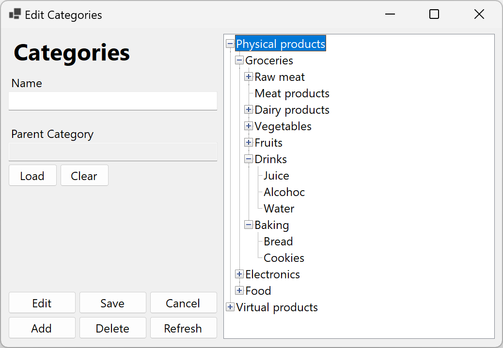

**Notice**: Categories **can** have the same names. For example, Coffee in the shop and Coffee in the cafe.

#### Edit Transactions
Transaction — one money operation (e.g. one trip to the supermarket, one paycheck, etc.). Each transaction consists of at least one Item (about it later).

Each transaction has:
- Transaction Type (e.g. Income for salary, Expense for shopping)
- Date (you can choose not only today, but also previous days)
- Place (optional) — where you've bought something
- Cash Facility (e.g. what card you've used to pay for shopping / what card your paycheck went to)
- Sum (in currency of the cash facility) — money received/spent
- Currency (on the price tag, actual money spent/received)
- Description (optional)

When you are adding a new transaction, after pressing the "Add" button the form for editing Items for this transaction will be shown. About editing Items read next section.

If you want to edit transaction's items, double click on that transaction in the table.
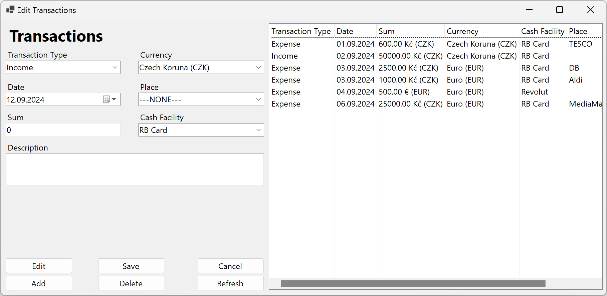

Examples in next part.

#### Edit Items
Item — things or services grouped into categories. Items don't exist by themselves, but only as part of some transaction.

Each item has:
- Sum (in currency of transaction)
- Category (e.g. *Dairy products* or *Subscriptions*). Use "Choose" and "Clear" buttons to choose category or clear the choice respectively
- Tags
- Description
- (Hidden) Sum in Main Currency — sum of item converted to the Main Currency

In the table you can see all items assigned to some transaction and in the end highlighted in blue total spent sum.

When you're adding a new item/changing an existing one, the CurrencyAPI will be used to convert your sum into sum in the Main Currency.
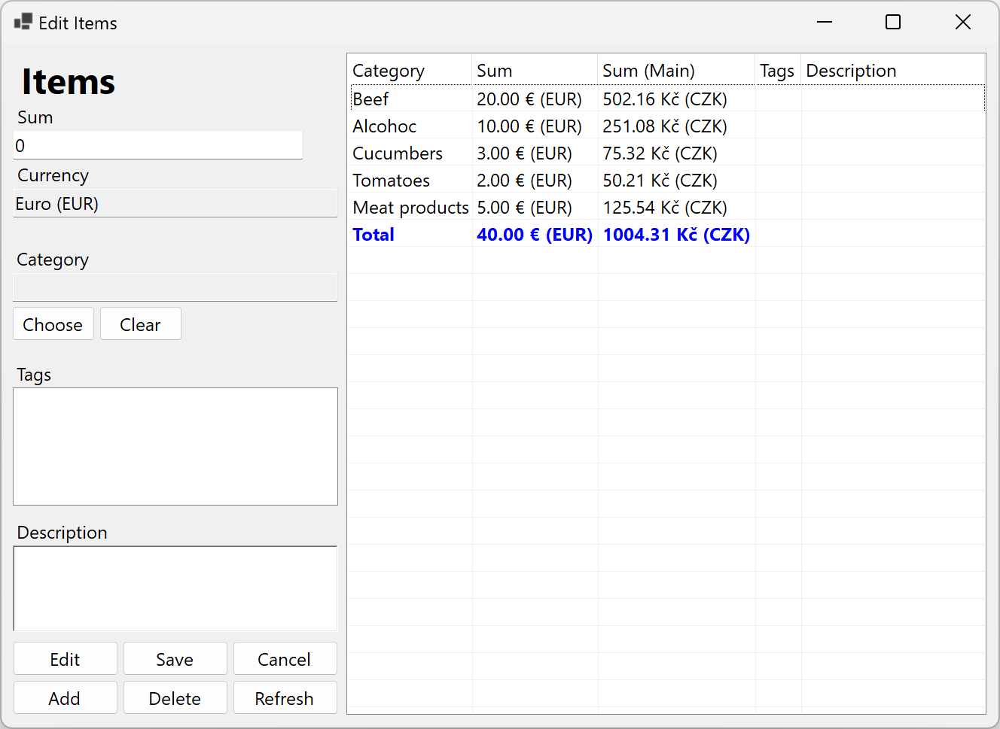

**Warning**: In case of any problems the item won't be added/changed.

Example: You went to the supermarket. You're in Czech Republic (prices are in Czech Koruns), you have card in US Dollars and your Main Currency is Euro. You've bought next groups of things (items):

| Category       | Sum    | Sum (Main) |
| -------------- | ------ | ---------- |
| Meat           | 200 Kč | 8 €        |
| Drinks         | 100 Kč | 4 €        |
| Vegetables     | 100 Kč | 4 €        |
| Dairy products | 100 Kč | 4 €        |

Finally we have the following transaction:
- Transaction Type — Expense
- Place — TESCO
- Cash Facility — Card (in US Dollars)
- Sum — 22 $
- Currency — Czech Koruna (CZK)

### Everyday use
Congratulations! Now you can fully use the application.

When you have some new money operations, add new transaction and items for it.

Then you have ability to analyze your income/expenses.

#### Analyze Items
In terms of the application it means filtering items and summarizing the results.

You can filter by next parameters:
- Specific category (with all subcategories) or All
- Specific transaction type or All
- Specific place or All
- Start date or None
- End date or None

When filters are set up, press "Get" button and in the table you'll see filtered results. They'll be grouped by transaction types and summarized.
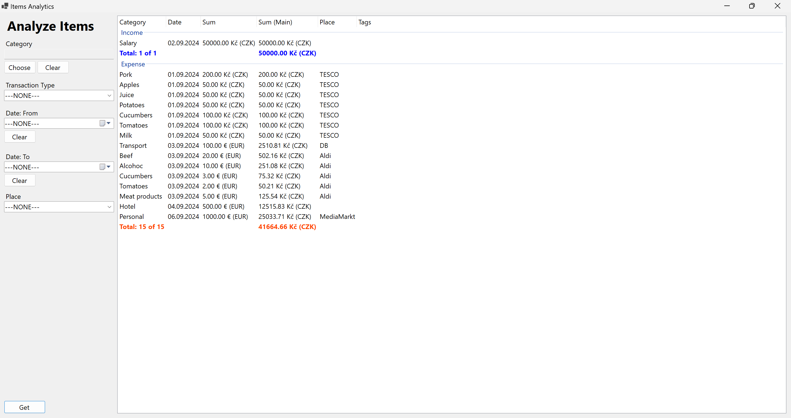

#### Currency Exchange
This is a mini built-in application that allows you to exchange money. Just choose 2 currencies, date and enter amount you want to convert and press the "Convert" button.
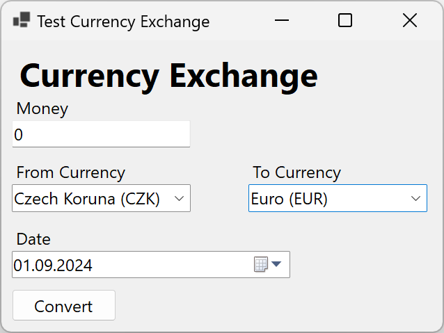

## Example
Project has an example DB that you can play with.

## Programmer's description
Main framework:
- [Windows Forms](https://github.com/dotnet/winforms) — Framework for developing GUI Windows application

Used packages:
- [Currencyapi](https://www.nuget.org/packages/Currencyapi/1.0.2?_src=template) — Official CurrencyAPI package
- [Dapper](https://www.nuget.org/packages/Dapper/2.1.35?_src=template) — Micro-ORM to easy work with ADO.NET
- [System.Data.SQLite.Core](https://www.nuget.org/packages/System.Data.SQLite.Core/1.0.118?_src=template) — Official SQLite DB engine with ADO.NET provider

Program structure:
- Forms (for editing, viewing and analyzing DB data)
- Models for DB data (ORM)
- Settings file (persistent between sessions)
	- User settings
		- CurrencyAPI key
		- Path to DB
- SQLite Data Accessor (interface to work with DB data)
- Currency Converter (interface to exchange money)
- CurrencyAPI (interface to get exchange rates from CurrencyAPI)
- Money Type (special type to store and view money with fixed point)
	- Money are stored in DB as long number (in subunits) and shown as strings with period (e.g. 54.9$ are stored as 5490 and shown as 54.90$)
- Money Type Handler (ORM handler for Money Type)

The application starts with Program file that starts Main Window, where all other windows are called from.

### DB structure
In this project is used SQLite database because it's easy and works without a server.
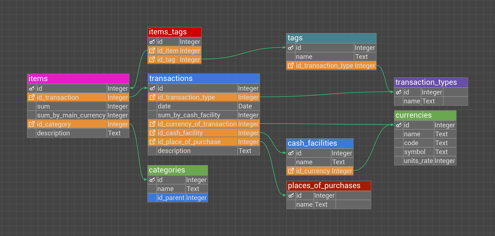

## Roadmap
- User don't need to enter currency info by themself, but they can choose from the list of supported currencies.
- More transaction types (e.g. Return of goods)
- More filters for items analyzer
- Ability to see statistics (e.g. Compare expenses over several months)
- Ability to password-protect the DB
- Ability to add Items without internet. Sum in Main Currency will be set when there is an internet connection.

## Project for
This project was created as a semester project for the Programming 2 - NPRG031, UK MFF 2024.

## License
This project is licensed under the terms of the MIT license.